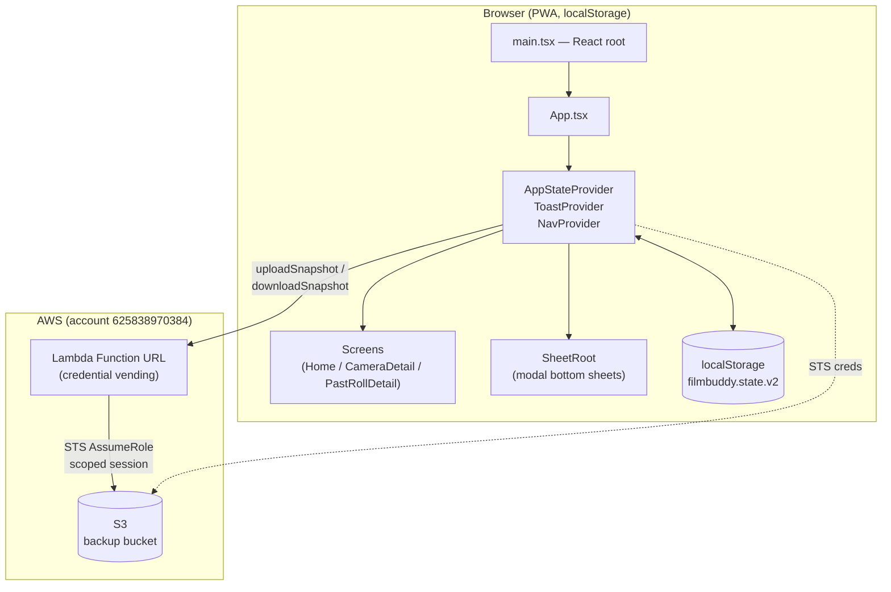
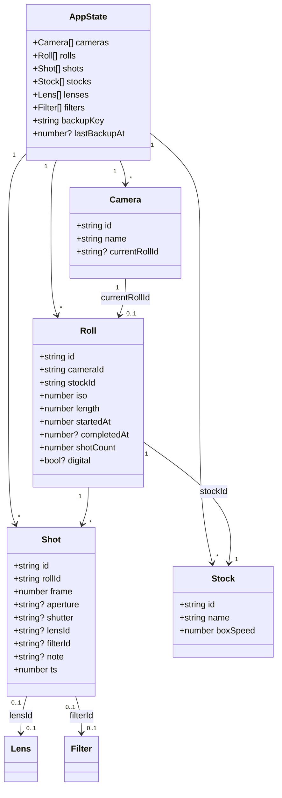
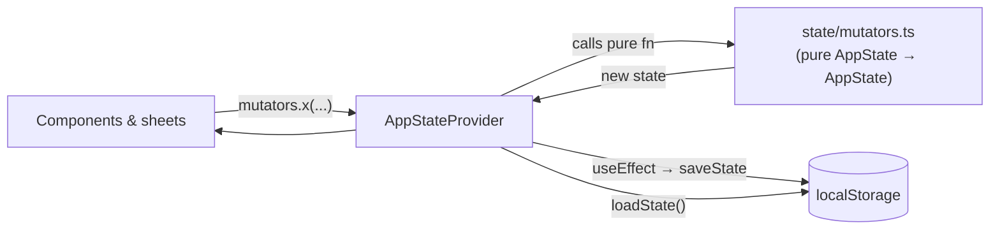
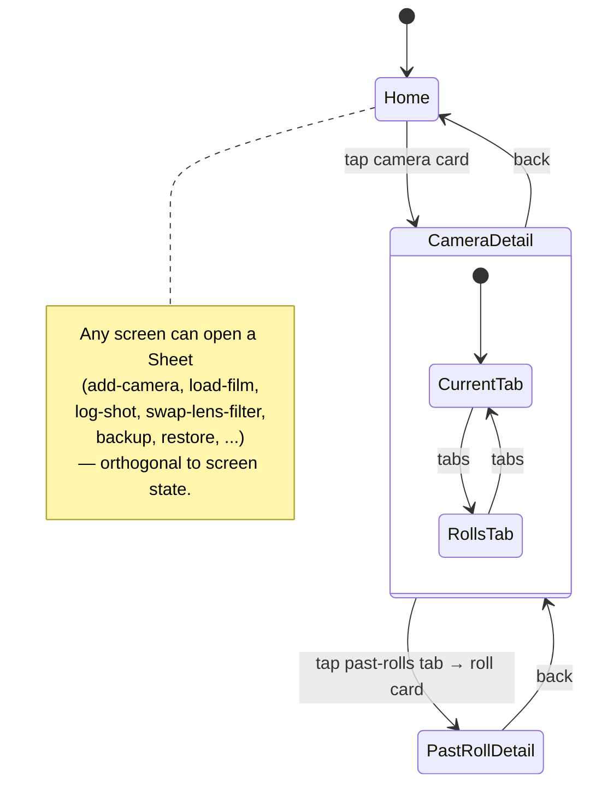
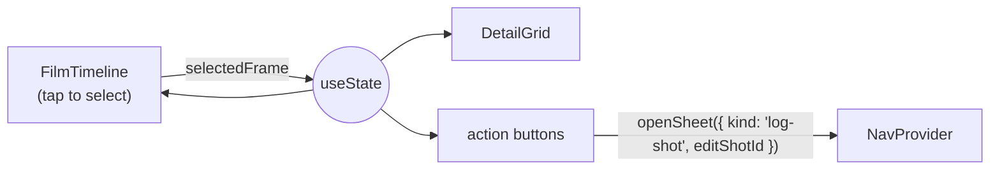
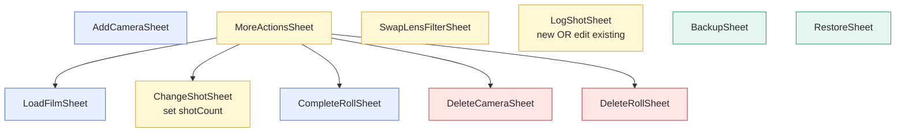
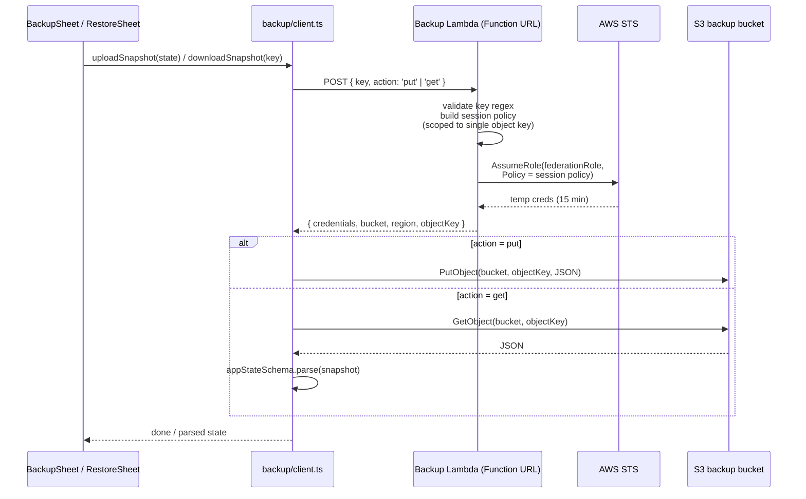
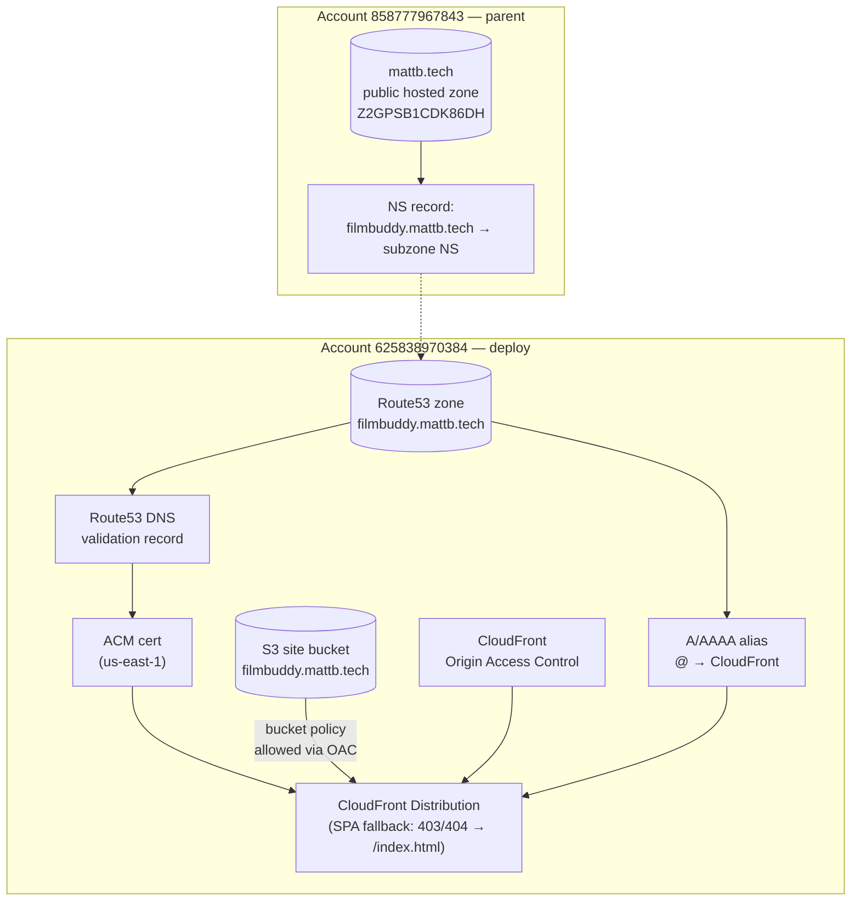
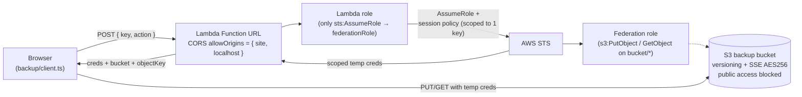
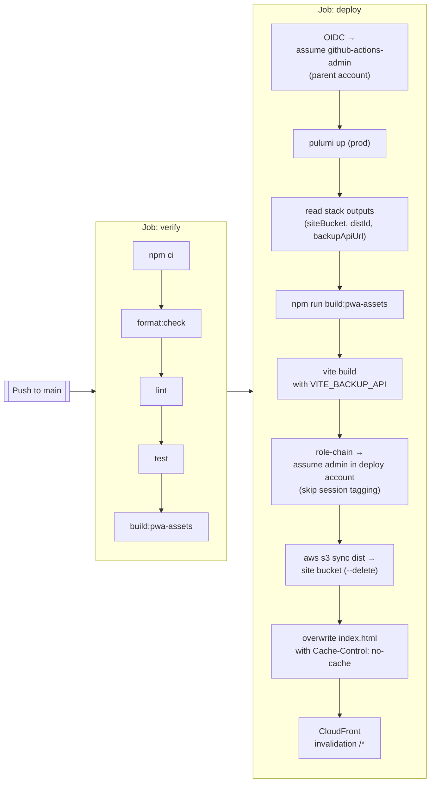

# FilmBuddy code walkthrough

A guided tour of the FilmBuddy codebase — the PWA, the state model, the backup flow, and the AWS infrastructure that ties it all together.

## What it is

FilmBuddy is a personal film-photography logbook. You register your cameras, load a roll of film into one, and then log frames as you shoot — aperture, shutter, lens, filter, notes. It's a PWA installed from `filmbuddy.mattb.tech` onto an iPhone home screen. All data lives in `localStorage`; the only cloud dependency is an opt-in encrypted-at-rest backup to S3 keyed by a random string the user copies down.

## Repo layout

```
filmbuddy/
├── packages/
│   ├── app/      — the React PWA (Vite, TypeScript)
│   └── infra/    — Pulumi (TypeScript) + the backup Lambda
├── .github/workflows/deploy.yml   — CI: verify, pulumi up, build, sync to S3
├── package.json                   — npm workspaces root
└── design/                        — design notes and mockups
```

It's an npm workspaces monorepo. The root `package.json` exposes aggregate scripts (`typecheck`, `lint`, `test`, `build`) that fan out to each workspace, plus `dev` which delegates to the app package.

---

## Part 1 — The app

### High-level architecture



The app is a single-page React 18 app. There's no router library — navigation is a three-state context. State is kept in memory via React context, mirrored to `localStorage` on every change, and optionally snapshotted to S3.

### Entry point

`packages/app/src/main.tsx` is vanilla: grab `#root`, render `<App />` in `StrictMode`.

`packages/app/src/App.tsx` wires the providers and picks a screen:

```tsx
<AppStateProvider>
  <ToastProvider>
    <NavProvider>
      <Brand header />
      <Screens /> {/* Home | CameraDetail | PastRollDetail */}
      <SheetRoot /> {/* whichever modal sheet is open */}
    </NavProvider>
  </ToastProvider>
</AppStateProvider>
```

### State

The domain model lives in `packages/app/src/state/types.ts`. It's six top-level arrays plus two backup fields:



Entities are linked by string IDs — there are no nested structures. Shots carry `lensId` / `filterId` only when a swap happened at that frame, and "what lens/filter am I on right now" is computed by walking the shots backward until you find one with a non-`undefined` value (see `latestAtOrBefore` in `state/selectors.ts:27`). That's how a swap at frame 5 silently stays in effect for frames 6, 7, 8 without duplicating data.

#### Store, mutators, persistence



- `state/store.tsx` owns a single `useState<AppState>`. Every mutator in `state/mutators.ts` takes `(state, args)` and returns a fresh `AppState` — pure functions, no side effects. The provider wraps each one in a `setState((prev) => fn(prev, ...))` call and exposes them via context.
- `state/persistence.ts` reads `STATE_KEY = 'filmbuddy.state.v2'` from `localStorage` on boot, and a `useEffect` in the provider writes it back on every change. On first run, `loadState()` generates a new `backupKey` (a `fb-xxxx-xxxx-xxxx` random string from `state/id.ts`) and saves it immediately — that key is the identity used for cloud backups.
- `state/selectors.ts` holds the read-side helpers: `currentRoll`, `shotsForRoll`, `completedRollsForCamera`, plus the "effective lens/filter at frame N" walkers and a `relTime` / `daysSince` pair used by the backup-staleness UI.

A mutator worth calling out: `loadRoll` (mutators.ts:69). When you load a new roll into a camera that already has one, it auto-completes the previous non-digital roll _before_ creating the new one, so past-rolls don't accumulate unfinished entries.

#### Why two kinds of roll?

A "digital" roll is a special case: when you add a camera with `startDigitalRoll: true`, it gets a roll with `digital: true`, `length: 9999`, and no stock. The UI uses `digital` as a branch point in several places — it hides the film-length progress bar, labels the counter as "digital" instead of `/ 36`, and shows a different label on the "Change shot number" action ("Set in-camera counter" vs. "Change shot number"). This lets you use the same log-shot / swap-lens affordances for digital cameras without film-specific UI.

### Navigation



`nav/context.tsx` defines a `Screen` discriminated union and a `SheetState` union, and `NavProvider` exposes `openScreen` / `openSheet` / `closeSheet`. Screens and sheets are independent: the current sheet is a separate piece of state, so opening a backup sheet from the Home screen doesn't push a history entry or unmount the underlying screen.

`App.tsx` picks which screen component to render based on `screen.name`. `SheetRoot` (`sheets/SheetRoot.tsx`) does the analogous switch on `sheet.kind`. When no sheet is open, `SheetRoot` renders `null`.

### Screens

There are three screens, each in `packages/app/src/screens/`:

| Screen         | File                 | Purpose                                                                                               |
| -------------- | -------------------- | ----------------------------------------------------------------------------------------------------- |
| Home           | `Home.tsx`           | List of cameras (`CameraCard`), add-camera card, stale-backup banner, backup footer.                  |
| CameraDetail   | `CameraDetail.tsx`   | One camera: current roll timeline + detail grid, "Rolls" tab with past rolls, primary action buttons. |
| PastRollDetail | `PastRollDetail.tsx` | A completed roll, read-only timeline + detail grid + delete button.                                   |

`CameraDetail` is where most of the action lives. A single `selectedFrame` state drives three children:

- `FilmTimeline` — horizontally scrollable row of frames, each annotated with a dot for "has log" and a swap icon for "lens/filter changed here".
- `DetailGrid` — the aperture / shutter / lens / filter for the selected frame, reading the "effective" lens/filter via the selectors.
- The primary action buttons — "Swap lens", "Log shot" (shows "Edit shot" if the selected frame already has a log), "More".



### Sheets

Sheets are modal bottom sheets — all of them share `ui/Sheet.tsx`, which handles mount/unmount animation (`EXIT_MS = 260`), a scrim, a grabber, and an optional right-side primary action button.



A useful pattern in `MoreActionsSheet.tsx:59`: when routing from one sheet to another, it calls `closeSheet()` first, waits 260ms (the sheet exit duration), and only then opens the next sheet. This lets the first sheet finish its exit animation before the next one slides up.

`LogShotSheet` double-duties as both "log a new shot" and "edit an existing shot" — `SheetState` carries an optional `editShotId`, and the sheet pre-fills from that shot and calls `updateShot` instead of `logShot` on submit.

### UI primitives

`packages/app/src/ui/` holds generic building blocks: `Button`, `IconButton`, `Chip`, `Field`, `Input` / `Textarea`, `Pill`, `Seg` (segmented control), `Sheet`, `SuggestInput` (combobox with suggestions from prior values), and the `ToastProvider` / `useToast` pair. They're re-exported from `ui/index.ts`.

`SuggestInput` is what gives sheets their autocomplete — it takes a `suggestions: string[]`, which the sheets build from `suggestStrings(state, 'stock' | 'lens' | 'filter' | 'aperture' | 'shutter' | 'camera-name')` in `state/selectors.ts:80`. That's why once you've logged `f/5.6` or `Portra 400` once, they show up as quick picks in later sheets.

### Backup and restore

The backup flow is the only feature that leaves the device. The high-level handshake:



What makes this safe-ish without user accounts:

- The only identity the user has is `backupKey` — a random `fb-xxxx-xxxx-xxxx` string from `state/id.ts`. No auth server, no passwords.
- The browser never has durable AWS credentials. It calls the Lambda Function URL with the key + action, and gets back short-lived STS credentials _scoped to exactly one S3 object_ via an inline session policy. That policy is attached per request in `packages/infra/lambda/handler.ts:80`:
  ```js
  Action: action === 'put' ? ['s3:PutObject'] : ['s3:GetObject'],
  Resource: `arn:aws:s3:::${BUCKET}/${objectKey}`,  // key/state.json
  ```
- Roles are split so the Lambda itself can't touch S3 directly: it has a role (`backup-lambda-role`) whose only privilege is `sts:AssumeRole` onto a federation role (`backup-federation-role`), which in turn holds the bucket permissions (`packages/infra/src/backup.ts:77`–`140`). That way if the Lambda code has a bug, the worst case is vending _overly_ broad credentials — it can't bypass STS and hit the bucket itself.
- Backups are opaque JSON snapshots of the entire `AppState`. Restore replaces the local state but preserves the device's own `backupKey` (see `restoreFromSnapshot` in `mutators.ts:267`) so the same device keeps writing to the same cloud slot.
- On the client side, `backup/schema.ts` runs every downloaded snapshot through a Zod schema before handing it to the reducer. The bucket is server-side encrypted (AES256) and versioned — a bad restore can be recovered by rolling back the S3 object version.

The "stale backup" banner (`components/StaleBackupBanner.tsx`) on Home is a gentle nag: it appears when `daysSince(state.lastBackupAt) > BACKUP_STALE_DAYS` (15).

### Tests & tooling

- `npm run test` → Vitest + jsdom + Testing Library. Test files live next to sources: `App.test.tsx`, `state/state.test.ts`, `sheets/sheets.test.tsx`, `backup/schema.test.ts`, `ui/ui.test.tsx`.
- `npm run typecheck` → `tsc --noEmit` per workspace.
- `npm run lint` → `eslint .` (flat config in `eslint.config.js`).
- `npm run format` / `format:check` → Prettier.
- `npm run dev` (at repo root) → `vite` for the app.
- `vite.config.ts` sets up React, the PWA plugin (Workbox, manifest, runtime caching for Google Fonts), and injects `VITE_BACKUP_API` from the environment at build time.

---

## Part 2 — The infrastructure

### Accounts and roles

FilmBuddy spans two AWS accounts:

| Account                 | Role                                                                                                                                                     |
| ----------------------- | -------------------------------------------------------------------------------------------------------------------------------------------------------- |
| `858777967843` (parent) | Owns the `mattb.tech` public hosted zone. Holds the GitHub OIDC role `github-actions-admin`.                                                             |
| `625838970384` (deploy) | Owns everything FilmBuddy-specific: the S3 site bucket, CloudFront, the `filmbuddy.mattb.tech` hosted subzone, the backup bucket, and the backup Lambda. |

Pulumi assumes into each account as needed via two named providers in `packages/infra/src/providers.ts`. The deploy provider handles app resources; the parent-zone provider only writes the NS record for the subzone delegation.

### Site stack



`packages/infra/src/site.ts` builds this:

1. Private S3 bucket named after the domain (public access fully blocked).
2. An Origin Access Control so CloudFront can read the bucket while it's otherwise private.
3. A new Route53 zone for `filmbuddy.mattb.tech`.
4. An ACM certificate in `us-east-1` (CloudFront requirement), validated via a DNS record written into that zone.
5. The CloudFront distribution itself: HTTPS redirect, HTTP/2+3, AWS-managed `CachingOptimized` policy, SPA-friendly custom error mappings (403 and 404 → `/index.html` with 200), and the ACM cert as the viewer cert.
6. A bucket policy granting `s3:GetObject` to the CloudFront service principal only when the source ARN matches this distribution.
7. A/AAAA alias records at the apex pointing to CloudFront.

`packages/infra/src/delegation.ts` is a separate, small file: it uses the parent-zone provider to write an NS record in `mattb.tech` pointing at the subzone's name servers, so DNS resolution actually crosses account boundaries. The parent zone's ID is pinned as a constant.

### Backup stack



`packages/infra/src/backup.ts` is the other half of the story. Worth noting:

- **Bucket hardening**: versioning enabled, AES256 SSE, public access fully blocked, CORS narrowed to `https://filmbuddy.mattb.tech` + `http://localhost:5173`.
- **Two-role split**: the Lambda's own role can't touch S3 at all. It can only assume the federation role, which has the bucket permissions. The Lambda then narrows that further via an inline `Policy` parameter on `AssumeRoleCommand` (`lambda/handler.ts:91`), scoping each session to a single object key for 900 seconds.
- **Lambda code**: `lambda/handler.ts` is the whole API — no framework. It validates the key against the `fb-xxxx-xxxx-xxxx` regex, validates `action` is `put` or `get`, builds the session policy, calls STS, and returns the credentials. `scripts/build-lambda.mjs` bundles it with `esbuild`, targeting Node 20 ESM, marking `@aws-sdk/*` external (provided by the Lambda runtime).

### Pulumi project layout

- `packages/infra/index.ts` is the program entry — it calls `buildSite()`, `delegateSubzone(...)`, and `buildBackup()`, and exports the bucket names, CloudFront domain/ID, and the backup Function URL as stack outputs. The deploy workflow reads those outputs.
- `Pulumi.yaml` pins the stack backend to `s3://filmbuddy.mattb.tech-infra-state` (Pulumi state is stored in S3 under the `mattb.tech` bucket-naming scheme).
- `Pulumi.prod.yaml` is the `prod` stack config — currently just `aws:region: us-east-1`.

---

## Part 3 — Deployment

`.github/workflows/deploy.yml` runs on pushes to `main` (and manual dispatch) and has two jobs:



Key details:

- Auth starts via GitHub OIDC into the **parent** account's `github-actions-admin` role. Pulumi's providers STS-hop from there into the deploy account as needed for resource changes.
- The Pulumi run is always applied first so the workflow can read the **live** backup-API URL and bake it into the SPA via the `VITE_BACKUP_API` build-time env var. That's why `backup/client.ts` reads `import.meta.env['VITE_BACKUP_API']` and throws if it's unset.
- After the SPA build, the workflow role-chains into the deploy account's `admin` role (with `role-skip-session-tagging: true`, since the chained credentials can't re-tag the session) so the `aws s3` and `aws cloudfront` CLIs run directly against deploy-account resources rather than relying on the parent role's cross-account permissions.
- `aws s3 sync --delete` does the upload with a default 5-minute cache, then immediately overrides `index.html` to `Cache-Control: no-cache` so CloudFront (and browsers) always revalidate the HTML entrypoint — the PWA's service worker handles asset versioning for the rest.
- Final step is a full `/*` CloudFront invalidation.

---

## Putting it together — tracing a shot log end to end

Starting from "user taps Log shot on frame 7":

1. **Component click** — `CameraDetail.tsx` calls `openSheet({ kind: 'log-shot', cameraId, editShotId? })`. The selected-shot lookup in the same file decides whether this is a new log or an edit.
2. **Sheet mounts** — `SheetRoot.tsx` picks `LogShotSheet`. Its form defaults the frame to `roll.shotCount + 1` for new logs, or the existing shot's frame (disabled) for edits.
3. **Autocomplete** — `suggestStrings(state, 'aperture')` / `'shutter'` in `state/selectors.ts` produces prior values, merged with the preset lists in `sheets/constants.ts`.
4. **Submit** — the sheet calls `mutators.logShot({ cameraId, frame, aperture, shutter, note })`.
5. **Reducer** — `logShot` in `state/mutators.ts:199` either updates the shot at `(rollId, frame)` or appends a new one, and bumps `roll.shotCount` via `Math.max(r.shotCount, frame)`.
6. **Persistence** — the `AppStateProvider`'s `useEffect` fires and calls `saveState(state)`, serializing the whole `AppState` to `localStorage` under `filmbuddy.state.v2`.
7. **Re-render** — `CameraDetail` re-reads from context; `FilmTimeline` now shows a dot on frame 7, `DetailGrid` shows the new values, and the shot-counter pill updates.
8. **Eventually** — the user hits Backup. `BackupSheet` → `uploadSnapshot(state)` → POST to the Function URL → scoped STS creds → `PutObject` to `backup-bucket/<backupKey>/state.json`. The mutator `markBackedUp()` stamps `lastBackupAt`, dismissing the stale-backup banner.

That's the whole loop.

---

## Where to look for...

| You want to...                               | Start at                                                                                                          |
| -------------------------------------------- | ----------------------------------------------------------------------------------------------------------------- |
| Change what data a Shot stores               | `packages/app/src/state/types.ts`, then `state/mutators.ts` + `backup/schema.ts`                                  |
| Add a new sheet                              | `nav/context.tsx` (add to `SheetState`), a new file under `sheets/`, register in `sheets/SheetRoot.tsx`           |
| Tweak the timeline UI                        | `components/FilmTimeline.tsx` and `styles/global.css`                                                             |
| Add a new "effective at frame N" computation | `state/selectors.ts` — `latestAtOrBefore` is the pattern                                                          |
| Change backup validation or cloud shape      | `backup/schema.ts` (client) + `lambda/handler.ts` (server)                                                        |
| Tighten the backup IAM model                 | `packages/infra/src/backup.ts` — specifically the federation role's policy and the Lambda's inline session policy |
| Move domains or add environments             | `packages/infra/src/site.ts` (`DOMAIN`) and `Pulumi.prod.yaml` / new stack                                        |
| Change CI                                    | `.github/workflows/deploy.yml`                                                                                    |
